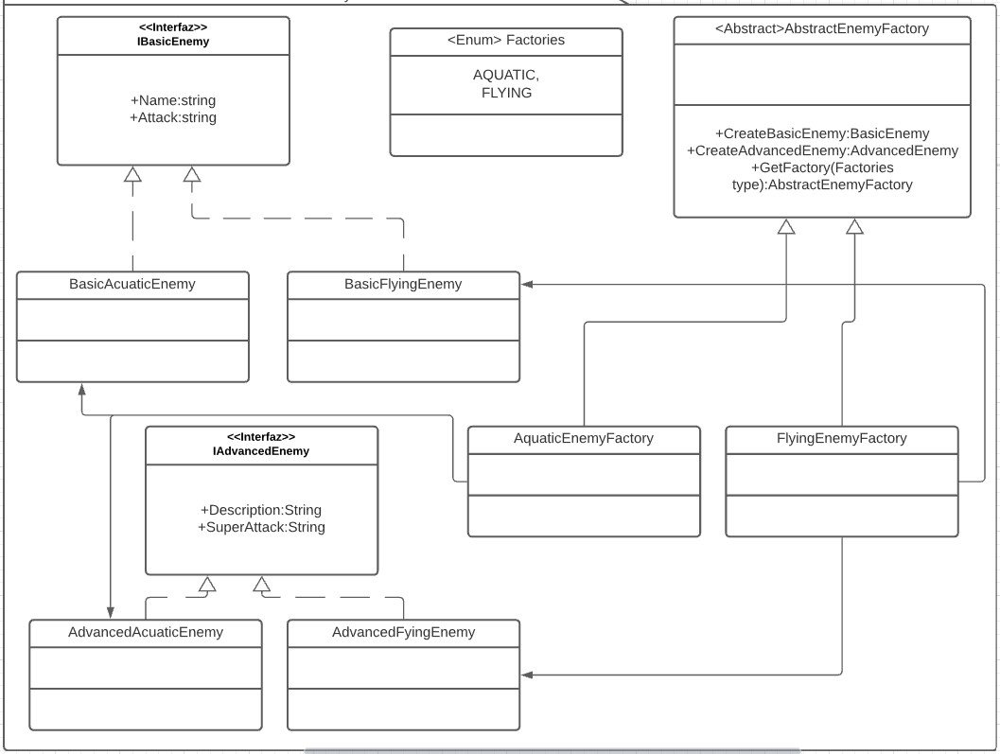

# Abstract factory

Es un patrón creacional. [Link descripción](https://sourcemaking.com/design_patterns/abstract_factory)

Este patrón se utiliza para generar familias de objetos a través del patron factory, donde el cliente no conoce la implementación del objeto concreto en sí si no que consigue las instancias a través de una factoría elegida previamente.

## Diagrama de clases

## SOLID

* Single responsibility

Cada Factoria tiene como responsabilidad crear los objetos de una misma familia. Solo haría falta modificarlas en caso de que se agreguen objetos a la familia o cambie el método de instanciación de los objetos existentes.

* Open/Closed principle

El abstract factory entra en conflicto con este principio cuando se necesita implementar la creación de un nuevo objeto de la familia, llevando a grandes refactorizaciones entre varias factorias para poder agregar un nuevo objeto a la familia 

* Liskov substitution

Las factorias se pueden intercambiar perfectamente gracias a que comparten una interfaz en común.

* Interface segregation

Podemos encontrarnos con un problema de segregación de interfaz cuando una familia de objetos tiene más objetos que otra familia, ya que la interfaz de abstract factory debe definir todos los métodos de creación compartidos por las factorias concretas

* Dependency inversion

Las factorias ayudan a cumplir con este principio dentro del sistema, pero la factoria en sí debe conocer la implementación concreta de una interfaz a instanciar.

